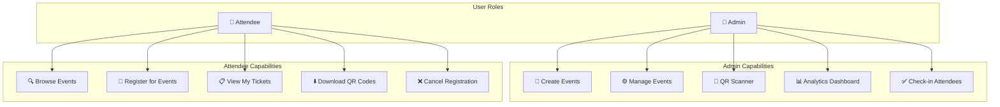
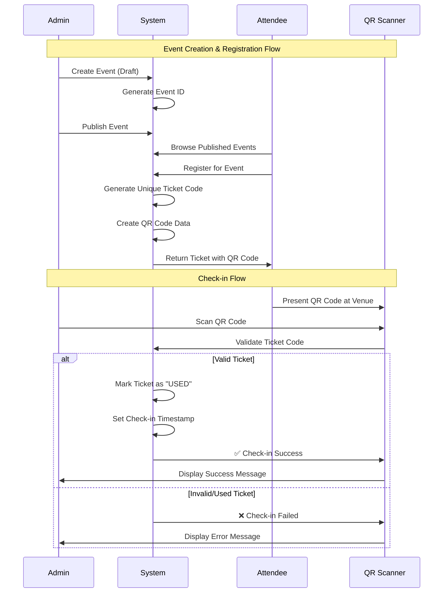
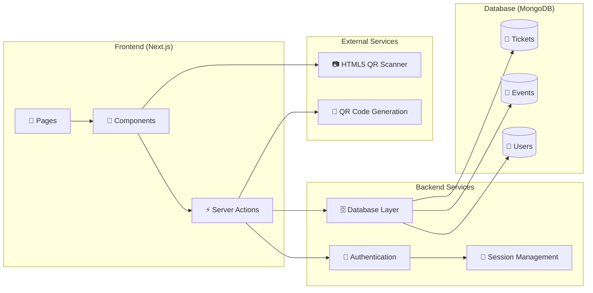

<h1 align="center">txr</h1>

<p align="center">
  <a href="https://nextjs.org/"></a>
  <a href="https://www.typescriptlang.org/"></a>
  <a href="https://www.mongodb.com/"></a>
  <a href="https://tailwindcss.com/"></a>
</p>

**txr** (pronounced _ticker_) is a production-ready, full-stack event management platform built for speed, security, and a premium user experience. Manage events, issue high-fidelity tickets, and track live attendance with ease.

---

## Key Features

### For Organizers

- **Live Admin Dashboard**: Real-time analytics on ticket sales, revenue, and attendee check-ins.
- **Dynamic Event Management**: Create, edit, publish, and view private/public events with custom capacities.
- **Live Attendance Scanner**: Integrated browser-based QR code scanner for seamless venue entry using `html5-qrcode`.
- **Attendee Tracking**: Instant access to attendee lists with precise check-in timestamps.

### For Attendees

- **Seamless Booking**: Support for both Free and Paid events with mock payment integration.
- **My Tickets Dashboard**: Personal portal to manage upcoming events and cancel registrations.
- **QR Entry Passes**: Instantly download high-quality QR codes for fast entry at event gates.
- **Responsive Design**: Polished, mobile-first UI built with a minimalist GitLab-inspired aesthetic.

---

## Tech Stack

- **Framework**: [Next.js 15 (App Router)](https://nextjs.org/)
- **Language**: [TypeScript](https://www.typescriptlang.org/)
- **Styling**: [Tailwind CSS v4](https://tailwindcss.com/)
- **Database**: [MongoDB](https://www.mongodb.com/) with [Mongoose](https://mongoosejs.com/)
- **Authentication**: JWT-based session management using [Jose](https://github.com/panva/jose)
- **Scanning**: [HTML5 QR Code](https://github.com/mebjas/html5-qrcode) for browser-based scanning

---

## Getting Started

### 1. Prerequisites

- Node.js 18+
- MongoDB instance (Local or Atlas)

### 2. Environment Setup

Create a `.env` file in the root directory:

```env
MONGODB_URI=your_mongodb_connection_string
JWT_SECRET=your_jwt_secret_key
SESSION_COOKIE_NAME=txr_session
```

### 3. Installation & Development

```bash
# Install dependencies
npm install

# Run the development server
npm run dev
```

Open [http://localhost:3000](http://localhost:3000) to see the application in action.

---

## Architecture

The project follows a modular architecture with a strict separation of concerns:

- `src/actions`: Server-side logic and database interactions.
- `src/components`: Reusable UI components (Atomic design principles).
- `src/models`: Mongoose schemas for data integrity.
- `src/lib`: Shared utilities for authentication and database connections.

---

## System Flow

### User Roles & Permissions



### Ticket Lifecycle



### Data Flow Architecture


